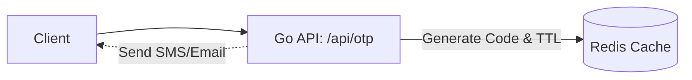
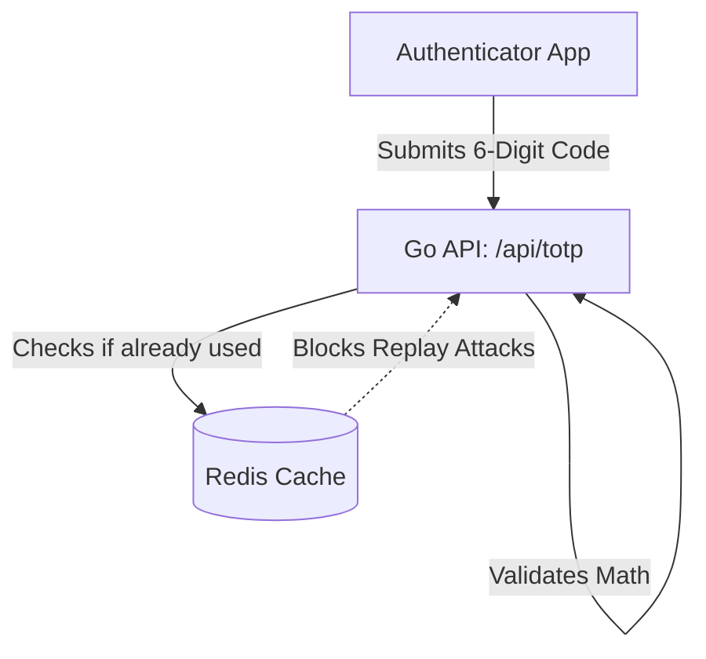

# Golang OTP & TOTP Authentication Module

A comprehensive production-ready Golang module demonstrating the implementation of **One-Time Passwords (OTP)** and **Time-Based One-Time Passwords (TOTP)** using **Gin** (web framework) and **Redis** (caching, TTL, and security).

---

## Architecture Overview

### 1. Standard OTP Flow (SMS/Email)
Uses Redis to enforce rate-limiting (cooldowns) and automatic expiration (TTL).


### 2. TOTP Flow (Authenticator App)
Uses mathematical time-slicing for generation and Redis caching for replay-attack prevention.


---

## Key Features

- **Layered Architecture**: Backend follows a strict separation of concerns (Routing -> Handlers -> Services).
- **Dependency Injection**: Global variables are eliminated; services and database clients are explicitly injected for high testability.
- **Advanced Rate Limiting**: Redis enforces a 1-minute cooldown between standard OTP requests to prevent spam.
- **Replay Attack Prevention**: Successfully used TOTP codes are cached with a 30-second TTL to guarantee a valid code can never be intercepted and reused.
- **Structured Logging**: Implements Uber's `zap` logger for high-performance, JSON-structured logging.

---

## Tech Stack

- **Language:** Go (Golang)
- **Web Framework:** Gin Web Framework
- **Caching & Security:** Redis
- **Testing Tools:** Postman, Google Authenticator App

---

## Execution Guide

### 1. Environment & Database Setup
Start your local Redis instance (must be running on port `6380` for default config):
```powershell
.\redis\redis-server.exe --port 6380 --bind 127.0.0.1
```
*(If using the default `.env` file, no further config is needed).*

### 2. Start the API Server
Run the Go application:
```powershell
go run cmd/api/main.go
```
The server will start on `http://localhost:8081`.

### 3. Verification (Postman)
**Standard OTP:**
- POST `http://localhost:8081/api/otp/send` with body `{"user_id": "test_user"}`
- POST `http://localhost:8081/api/otp/verify` with body `{"user_id": "test_user", "code": "YOUR_CODE"}`

**TOTP:**
- POST `http://localhost:8081/api/totp/setup` with body `{"email": "student@example.com"}`
- *(Scan the generated base-64 QR code in your browser with Google Authenticator)*
- POST `http://localhost:8081/api/totp/verify` with body `{"user_id": "test_user", "secret": "YOUR_SECRET", "code": "APP_CODE"}`

---

## Core Engineering Concepts

### Replay Protection & TTL
By leveraging Redis's innate `TTL` (Time-To-Live) functionality, we prevent replay attacks. A mathematically valid TOTP code is cached upon successful use. If an attacker intercepts the code and attempts to use it 5 seconds later, Redis identifies the `totp_used` key and blocks the request.

### Dependency Injection
The `OTPService` and `TOTPService` are injected into the `AuthHandler` at startup inside `main.go`. This decouples the handlers from the database layer, drastically simplifying the process of writing Unit Tests with Mock Databases.

### Time Skew Allowance (Clock Drift)
The TOTP algorithm relies heavily on synchronized clocks. To account for human typing delay and server/client clock mismatches, the library validates against the current 30-second window, as well as the previous and next windows, improving user experience without sacrificing security.

---

## Project Structure
- `/cmd/api`: Application entry point. Wires all dependencies, loads `.env`, and mounts routes.
- `/pkg/config`: Environment, Logger, and Redis client initialization.
- `/pkg/handlers`: HTTP Controllers parsing incoming JSON and formatting API responses.
- `/pkg/services`: Core business logic containing cryptography, Redis TTL commands, and rate-limiting.
- `/pkg/utils`: Standardized JSON response formatting.
